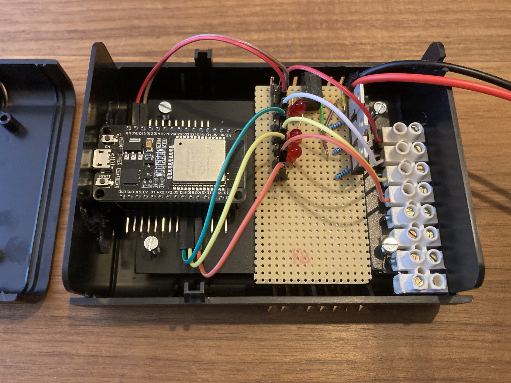
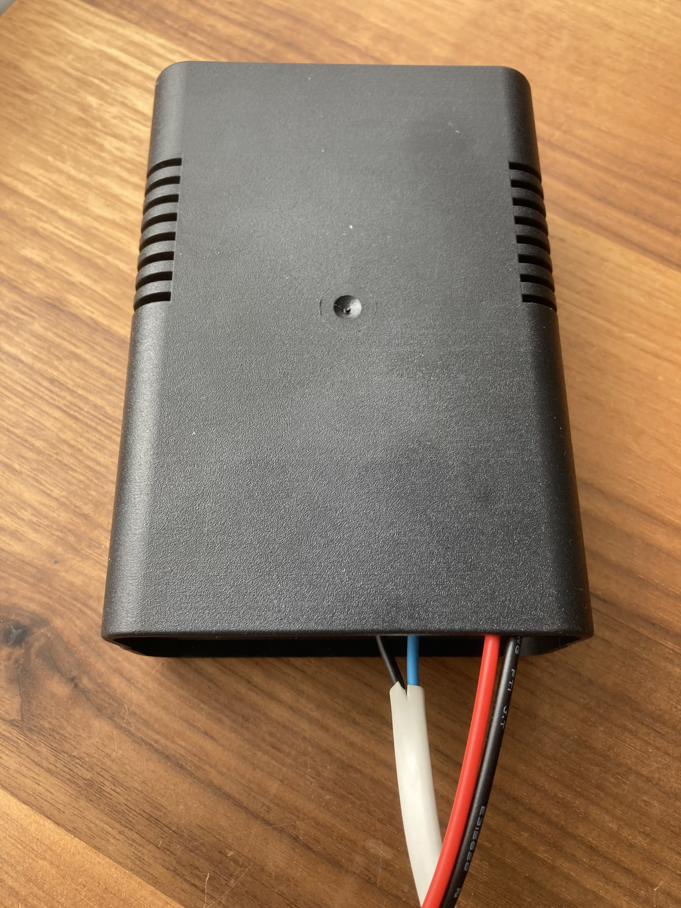
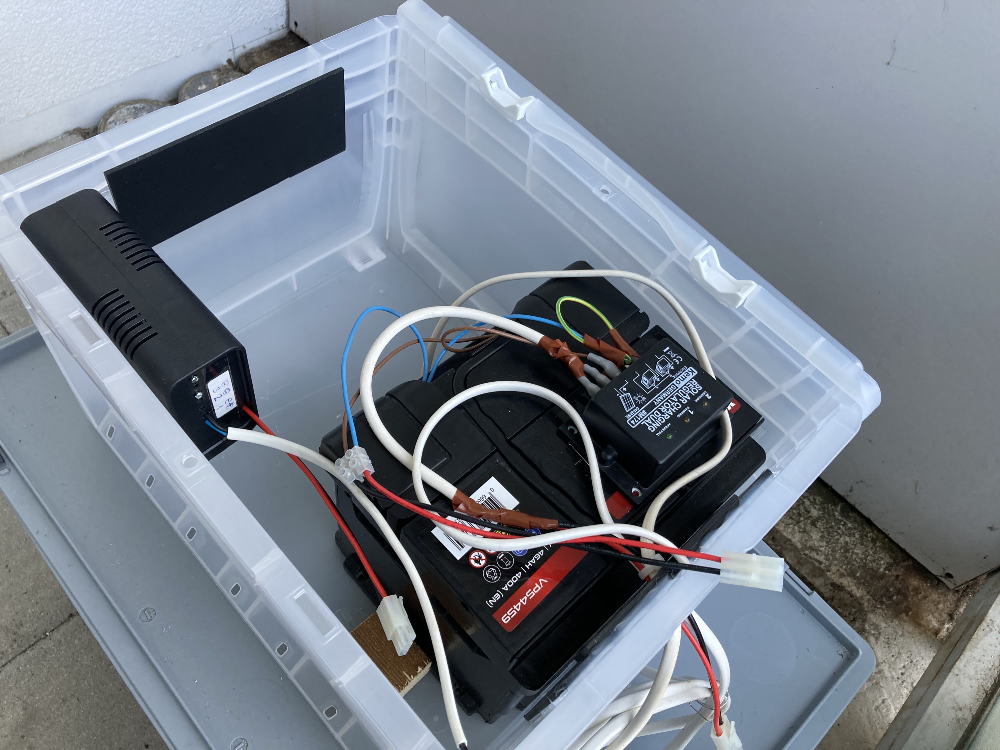

## Hydroponics Lab

We believe, healthy, fresh, organic, maintenance free and affordable nutrition is a matter of technics. This project aims to collect and share information around growing crops hydroponically.

Hydroponics is a subset of hydroculture which involves growing plants without soil. Hydroponic cultures need less water and allow a high degree of automation. Hydroponics have the potential to grow plants that are even healthier than conventionally grown organic plants, if water used is filtered and crops are protected from environmental pollution. If grown decentralized close to the customer, plants can be harvested nearly just in time, keeping valuable nutrients.

Different hydroponic systems are used in industrial soil plants and by hobbyist gardeners. Hydroponic systems need to be chosen based on soil and growing state.

With our **Hydroponic Shelf** we try to explore different hydroponic systems. 

We just got started. So make sure to come back to see our progress.

### Hydroponic shelf

### Contact

Find contact informations on [Tectil.ch](https://www.tectil.ch)

