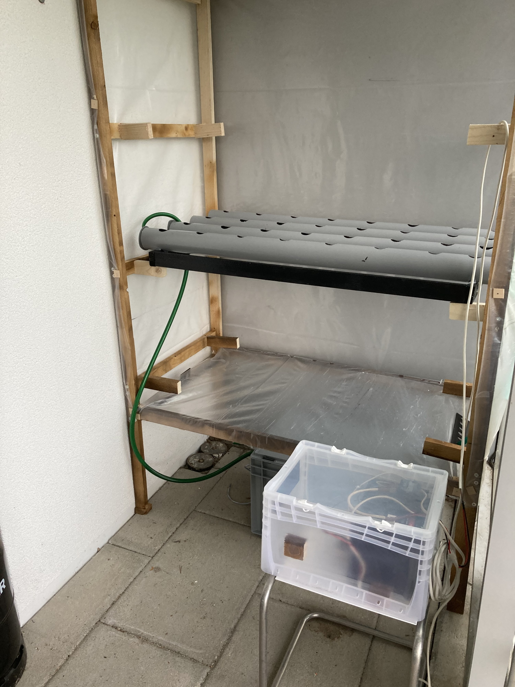

## Hydroponics Lab

### Thesis

We believe, the future of healthy, fresh, maintenance free and affordable nutrition lays in partial self-sufficiency. Furthermore, we believe, partial self-sufficiency with low maintenance costs can be achieved through technology. Hydroponics in our view can be the base, to reach the partial self-sufficiency goal.

### Hydroponics

Hydroponics is a subset of hydroculture which involves growing plants without soil. Hydroponic cultures need less water and allow a high degree of automation. Hydroponics have the potential to grow plants that are even healthier than conventionally grown organic plants, if water used is filtered and crops are protected from environmental pollution. If grown decentralized close to the customer, plants can be harvested nearly just in time, keeping valuable nutrients.

Different hydroponic systems are used in industrial soil plants and by hobbyist gardeners choosen by soil used and growing state of the plant. 

### Hydroponic shelf lab

With our **Hydroponic Shelf Lab** we try to explore different hydroponic systems. We plan to monitor plant growth and health state with Tensor Flow. Apart of AI driven techniques we want to explore the potential of social gardening. 

We just got started. So, make sure to come back to see how we progress on our journey.

### Contact

Find contact informations on [Tectil.ch](https://www.tectil.ch)

